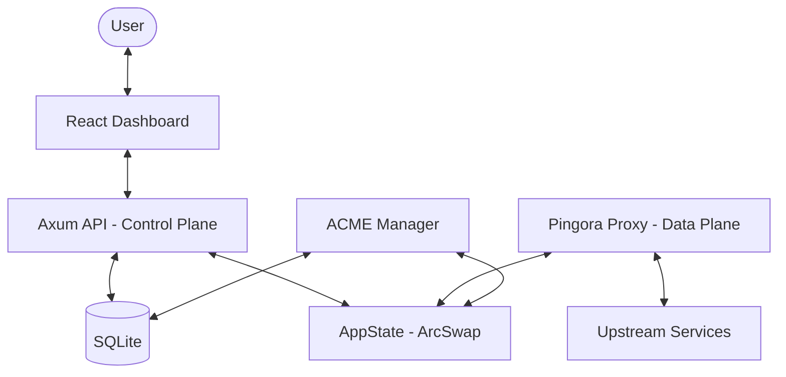

# Architecture

Pingora Proxy Manager follows a Control Plane / Data Plane architecture, both implemented in Rust within a single binary for simplicity and performance.

## System Overview

## 1. Control Plane (API)
- **Framework**: [Axum](https://github.com/tokio-rs/axum)
- **Port**: 81
- **Responsibility**: 
    - Managing user authentication (JWT).
    - CRUD operations for Proxy Hosts, Streams, and ACLs.
    - Interfacing with the SQLite database.
    - Triggering configuration reloads in the Data Plane.

## 2. Data Plane (Proxy)
- **Framework**: [Pingora](https://github.com/cloudflare/pingora)
- **Ports**: 8080 (HTTP), 443 (HTTPS)
- **Responsibility**:
    - High-performance request routing.
    - SSL/TLS termination with dynamic SNI certificate selection.
    - Applying filters (ACME challenge, ACL, Redirects).
    - Load balancing traffic to upstreams.
    - Collecting traffic statistics.

## 3. Configuration Management
We use a **Pull-based** model for the proxy state:
1. The API updates the database.
2. The API calls `sync_state()` which reloads the full configuration from the DB into a new `Config` struct.
3. The `AppState` (wrapped in `ArcSwap`) is updated with the new `Config`.
4. The Proxy refers to the `AppState` for every incoming request. Because it's an `ArcSwap`, this swap is atomic and zero-downtime.

## 4. Filter System
The proxy logic is modularized into filters:
- `AcmeFilter`: Intercepts `.well-known/acme-challenge/` requests for SSL validation.
- `AclFilter`: Checks IP whitelists and Basic Auth.
- `RedirectFilter`: Handles domain-level redirects.
- `SslFilter`: Forces HTTPS if configured.

## 5. ACME Manager
A background task that checks for expiring certificates every hour. It uses Certbot internally to handle both HTTP-01 and DNS-01 challenges.

---
Next: [[Development Setup]]
